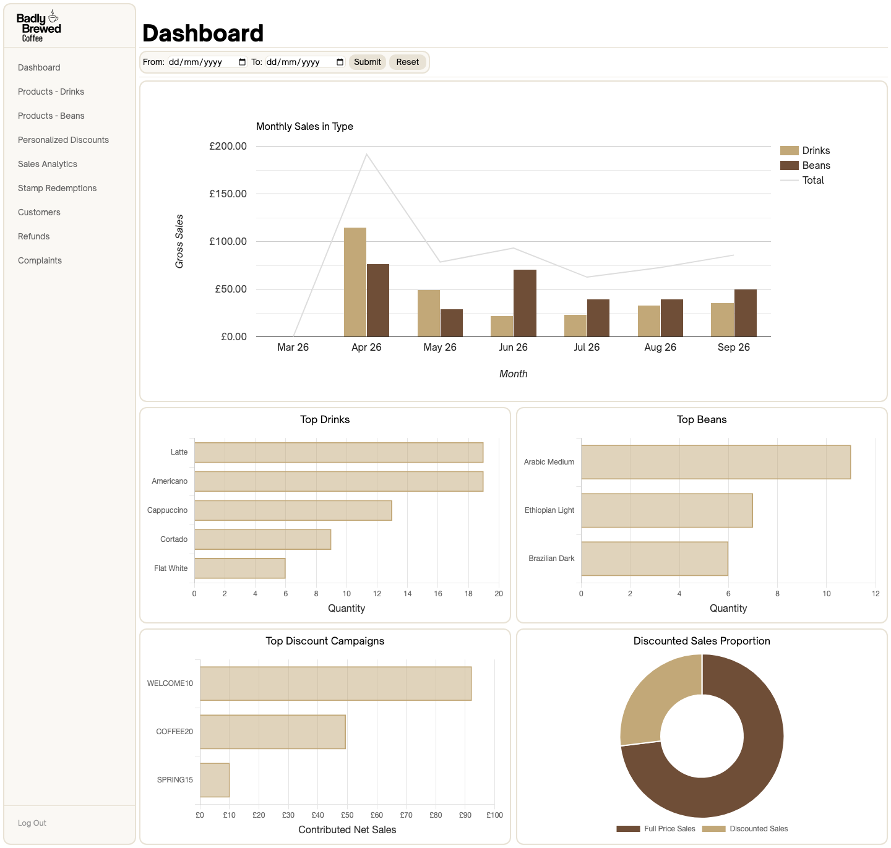
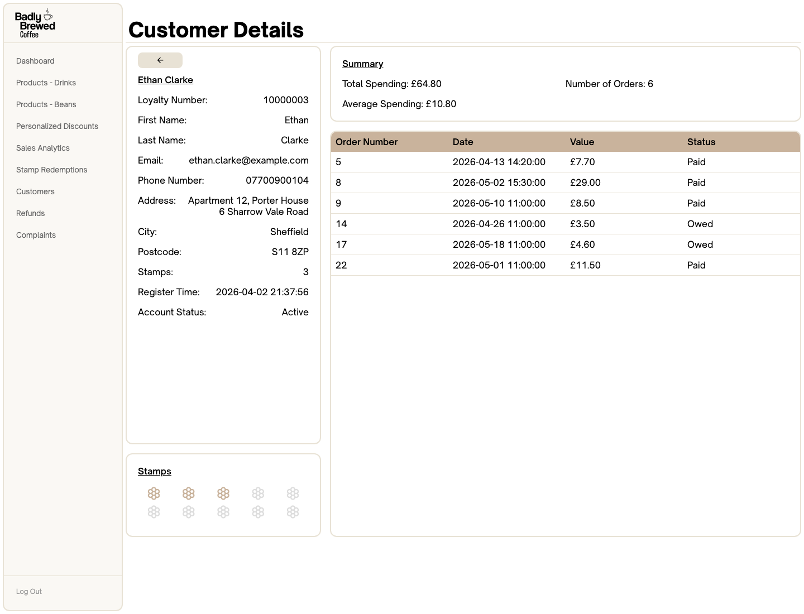
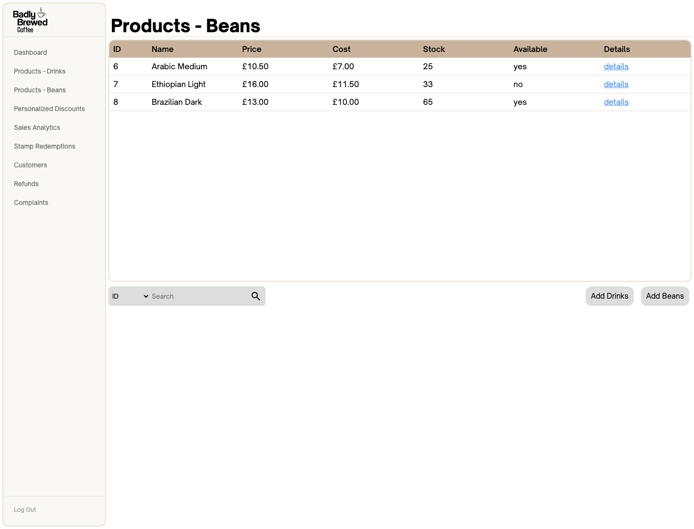
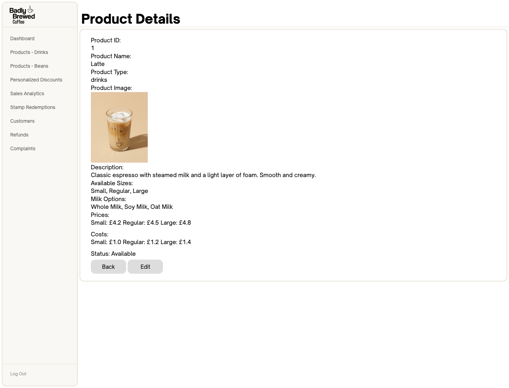
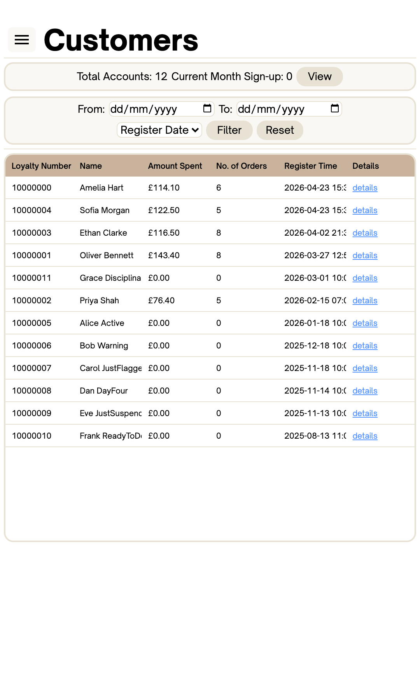

# Coffee Shop Web Application

The application we developed is a full-stack, role-based platform designed for a local coffee shop. 
It allows customers to manage their loyalty rewards, view purchase history and order coffee beans online. 
At the same time, providing baristas, managers and administrators with tools to manage sales, orders, refunds, stock and business performance.  

The project demonstrates end-to-end web development across database design, domain modelling, server-side routing, responsive interfaces, analytics and automated testing.

## Features

- **Role-based access:** Dedicated customer, barista, manager and administrator workflows with protected routes, session authentication, BCrypt password hashing and password-strength validation.
- **Customer storefront:** Product browsing and search, favourites, basket management, collection or bean delivery, discount codes, loyalty rewards, mock checkout, order history, refund requests and complaints.
- **Barista operations:** Customer lookup, in-store ordering and checkout, stamp management, free-coffee redemption, filtered sales and delivery records, daily summaries, refund processing and postage-label generation.
- **Management tools:** Product, variant and bean-stock management; configurable discount campaigns; customer and complaint monitoring; and date-filtered analytics for sales, refunds, products, customers, sign-ups and reward redemptions.
- **Administration:** Search and manage customers, employees and orders; correct payment statuses; review customer activity and purchasing habits; send personalised promotions; and suspend, reactivate or anonymise accounts.

## Technology

- **Language:** Ruby 4.0.1
- **Web framework and server:** Sinatra 4.2.1 and Puma 7.2.0
- **Database:** Sequel 5.101.0 and SQLite3 2.9.0
- **Authentication:** BCrypt 3.1.22
- **Charts:** Chartkick 5.2.1
- **Testing:** RSpec 3.13.2 and Capybara 3.40.0

## Acknowledgements

This application was originally developed by a six-person student team for the University of Sheffield's Introduction to Software Engineering module. 
The team collaborated on the customer, barista, manager and administrator systems, database design, interface design and automated testing.

My individual work is described in the My Contributions section below. I continued developing and refining parts of the application after the original submission.

## My Contributions

I was primarily responsible for the manager-facing system, which included product, discount and customer management, 
performance analytics, as well as the common design templates used in the manager-facing pages.

The Git history in this repository includes changes I made on my own post-submission. My older commits are made under the email `chting1@sheffield.ac.uk`, 
the older Git history is hidden for privacy but can be shared with recruiters upon request. 

What I delivered:

- **Manager Dashboard**
    - Visualisations of performance analytics with charts
    - Date range selection for the data shown  

- **Product Management**
    - Add, Update and Delete product features
      - Post-method form for product creation and updates
      - Stock management under update
      - New image replacement on update if provided
    - Product details page
    - Product table search and sort
    - SQL schema for `products` and `product_variants` tables  

- **Discount Management**
  - Active and past campaign views
  - Discount creation and updates
    - Configurable eligibility rules
    - Dynamic customer-discount distribution
  - Discount activation and deactivation
  - Discount details page
  - Stamp redemption tracking
  - SQL schema for `discount_codes`, `discount_redemptions`, `eligible_purchase_types` and `eligible_rules` tables  

- **Customer Summary**
  - Sortable list of registered customers
    - Registration and sales date range filters
  - Monthly customer signup summary
    - Line graph for monthly customer signups in the last 12 months
  - Customer details page
    - List of the customer's orders
    - Visualisation of stamps collected  

- **Manager Interface**
  - Header and sidebar navigation
  - Reusable scrollable table styling
  - Responsive layouts in manager dashboard, product, discount and customer pages  

- **Routing and Controller Development**
  - For all the above features  

- **Automated Testing**
  - RSpec acceptance and controller tests for all the above features
  - 94.1% RSpec line coverage on my code

## Screenshots – Manager Interface

### Manager Dashboard

Performance analytics covering revenue, top products, discount campaigns and discounted sales proportion.



### Customer Details

A manager view of a customer's profile, loyalty stamps, spending summary and order history.



### Product Management

The manager's bean inventory, including pricing, costs, stock levels and availability.



### Product Details

The manager's detailed product view with the Latte's image, description, options, pricing and costs.



### Responsive Layout

The customer page at a narrow responsive viewport, with collapsed navigation, stacked controls and a compact customer table.




## Installation

### Prerequisites

- Git
- Ruby 4.0.1
- Bundler
- SQLite3

### Setup

1. Clone the repository and navigate to the application directory:

   ```sh
   git clone https://github.com/samueltchs/coffee-shop-web-system.git
   cd coffee-shop-web-system
   ```

2. Enter the `application` directory and install the project dependencies. Run the remaining setup commands from this directory:

   ```sh
   cd application
   bundle install
   ```

3. Create and seed the development database:

   ```sh
   sqlite3 db/db.sqlite3 ".read db/schema.sql" ".read db/data.sql"
   ```

4. Start the application:

   ```sh
   bundle exec ruby app.rb
   ```

5. Open [http://localhost:4567](http://localhost:4567) in a browser for the customer-facing system.  
<br>
6. Employee accounts can sign in at [http://localhost:4567/employee-login-page](http://localhost:4567/employee-login-page).

### Demo Accounts

The seeded database includes the following accounts. Employee accounts use their username as their password.

| Role | Login | Password |
| --- | --- | --- |
| Customer | `ethan.clarke@example.com` | `Placeholder1!` |
| Admin | `Admin17!` | `Admin17!` |
| Manager | `Manager1!` | `Manager1!` |
| Barista | `Barista1!` | `Barista1!` |

The customer account includes seeded orders, favourites, discount activity, complaints, refunds, loyalty stamps and reward redemptions.

### Testing

The suite covers models, helpers, controllers and end-to-end acceptance workflows. 
It achieved 85.79% project-wide line coverage (3,305 of 3,852 lines), measured with SimpleCov.

From the repository root, enter the `application` directory and run the complete automated test suite:

```sh
cd application
bundle exec rspec
```
